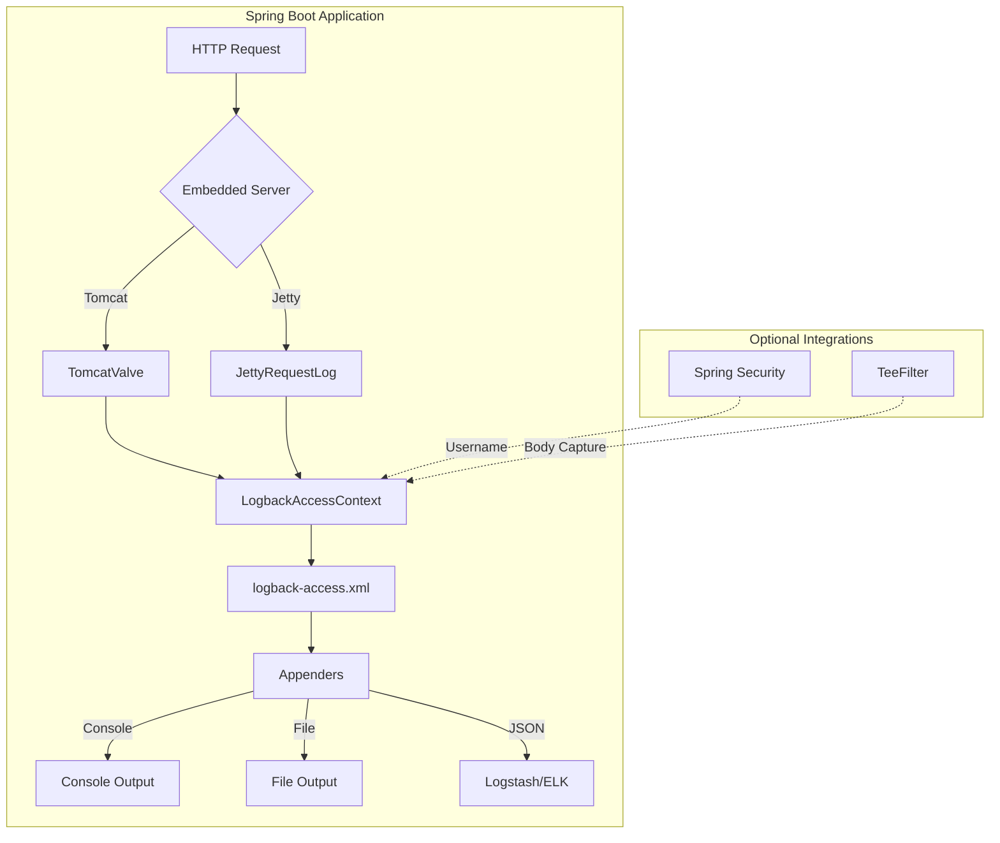
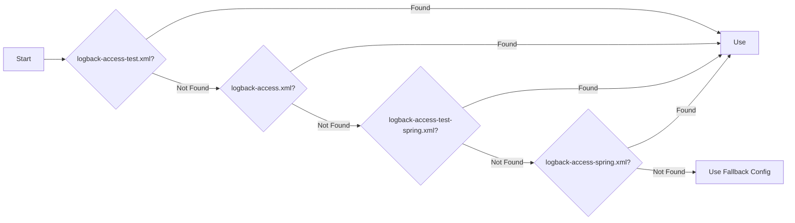
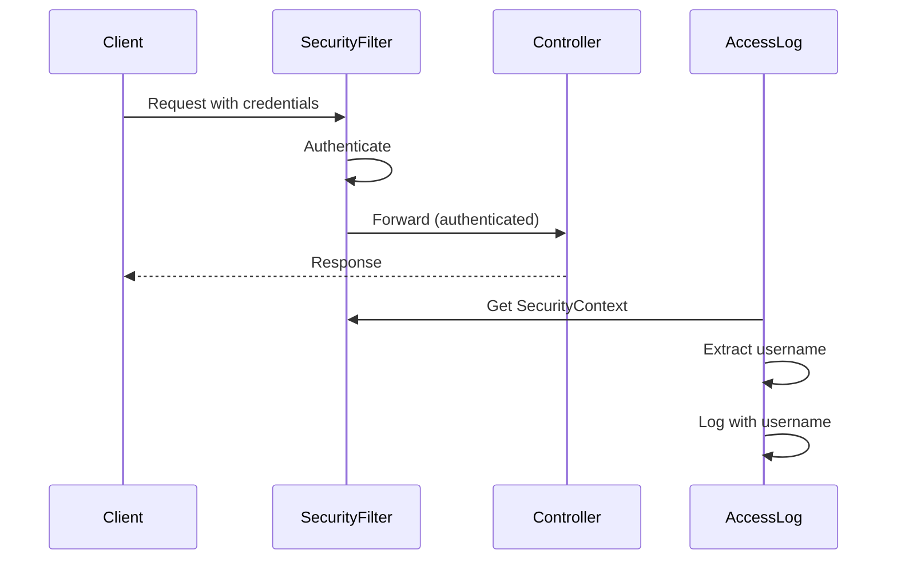
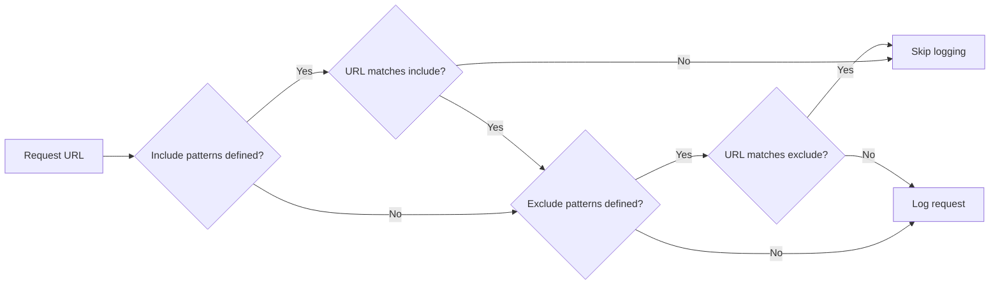

# Logback Access Spring Boot Starter

[](https://github.com/seijikohara/logback-access-spring-boot-starter/actions/workflows/test.yml)
[](https://central.sonatype.com/artifact/io.github.seijikohara/logback-access-spring-boot-starter)
[](https://seijikohara.github.io/logback-access-spring-boot-starter/)
[](https://www.apache.org/licenses/LICENSE-2.0)

<p align="center">
  
</p>

Spring Boot auto-configuration for [Logback Access](https://logback.qos.ch/access.html). This library provides HTTP access logging for Tomcat and Jetty embedded servers with seamless Spring integration.

## Architecture



## Features

| Feature | Description |
|---------|-------------|
| **Auto-configuration** | Automatic setup for Tomcat and Jetty embedded servers |
| **Spring Security** | Captures authenticated username in access logs |
| **TeeFilter** | Records request/response body content |
| **Spring Profiles** | Environment-specific configuration with `<springProfile>` |
| **Spring Properties** | Property injection with `<springProperty>` |
| **URL Filtering** | Include/exclude patterns for selective logging |

## Requirements

| Component | Version |
|-----------|---------|
| Java | 21+ |
| Spring Boot | 4.0+ |

## Installation

<details>
<summary><strong>Maven</strong></summary>

```xml
<dependency>
    <groupId>io.github.seijikohara</groupId>
    <artifactId>logback-access-spring-boot-starter</artifactId>
    <version>VERSION</version>
</dependency>
```
</details>

<details>
<summary><strong>Gradle (Kotlin DSL)</strong></summary>

```kotlin
implementation("io.github.seijikohara:logback-access-spring-boot-starter:VERSION")
```
</details>

<details>
<summary><strong>Gradle (Groovy DSL)</strong></summary>

```groovy
implementation 'io.github.seijikohara:logback-access-spring-boot-starter:VERSION'
```
</details>

## Quick Start

### Step 1: Add Dependency

Add the starter to your project using the installation instructions above.

### Step 2: Create Configuration

Create `src/main/resources/logback-access.xml`:

```xml
<?xml version="1.0" encoding="UTF-8"?>
<configuration>
    <appender name="console" class="ch.qos.logback.core.ConsoleAppender">
        <encoder>
            <pattern>%h %l %u [%t] "%r" %s %b</pattern>
        </encoder>
    </appender>
    <appender-ref ref="console"/>
</configuration>
```

### Step 3: Run Application

Access logs appear in the console:

```
127.0.0.1 - - [06/Feb/2026:10:30:45 +0900] "GET /api/hello HTTP/1.1" 200 13
```

## Configuration

### Properties Reference

| Property | Description | Default |
|----------|-------------|---------|
| `logback.access.enabled` | Enable/disable access logging | `true` |
| `logback.access.config-location` | Custom configuration file path | Auto-detected |
| `logback.access.local-port-strategy` | Port resolution: `SERVER` or `LOCAL` | `SERVER` |
| `logback.access.filter.include-url-patterns` | Regex patterns for URLs to include | All URLs |
| `logback.access.filter.exclude-url-patterns` | Regex patterns for URLs to exclude | None |

### Configuration File Resolution



The starter searches for configuration files in the classpath in the order shown above.

### Log Pattern Elements

| Conversion | Description | Example |
|------------|-------------|---------|
| `%h` | Remote host | `127.0.0.1` |
| `%l` | Remote log name | `-` |
| `%u` | Authenticated user | `admin` |
| `%t` | Timestamp | `06/Feb/2026:10:30:45 +0900` |
| `%r` | Request line | `GET /api/hello HTTP/1.1` |
| `%s` | Status code | `200` |
| `%b` | Response size (bytes) | `1234` |
| `%D` | Processing time (ms) | `45` |
| `%i{Header}` | Request header | `%i{User-Agent}` |

## Server Integration

### Tomcat

The starter registers a custom `Valve` implementing `AccessLog`. Registration occurs automatically when Tomcat is detected.

| Property | Description | Default |
|----------|-------------|---------|
| `logback.access.tomcat.request-attributes-enabled` | Enable request attributes for RemoteIpValve | Auto-detected |

### Jetty

The starter registers a custom `RequestLog` implementation. Registration occurs automatically when Jetty is detected.

> **Note**: Jetty 12 uses a native RequestLog API that operates at the core server level, separate from the Servlet API. This architectural difference affects TeeFilter compatibility. See [Known Limitations](#known-limitations) for details.

## Advanced Features

### Spring Security Integration



When Spring Security is present, the authenticated username appears automatically in access logs:

```
127.0.0.1 - admin [06/Feb/2026:10:30:45 +0900] "GET /api/secure HTTP/1.1" 200 14
```

No additional configuration is required.

### TeeFilter (Body Capture)

Enable TeeFilter to capture request and response bodies:

```yaml
logback:
  access:
    tee-filter:
      enabled: true
```

Use `%requestContent` and `%responseContent` patterns to access captured content.

| Property | Description | Default |
|----------|-------------|---------|
| `logback.access.tee-filter.enabled` | Enable TeeFilter | `false` |
| `logback.access.tee-filter.include-hosts` | Hosts to include (comma-separated) | All |
| `logback.access.tee-filter.exclude-hosts` | Hosts to exclude (comma-separated) | None |

> **Security Warning**: TeeFilter captures request/response bodies which may contain sensitive data (passwords, tokens, PII). Use `include-hosts`/`exclude-hosts` to limit scope, and consider implementing custom masking in production environments.

### URL Pattern Filtering

Filter access logs using regex patterns:

```yaml
logback:
  access:
    filter:
      include-url-patterns:
        - /api/.*
      exclude-url-patterns:
        - /actuator/health
        - /actuator/info
```



### JSON Logging (Logstash/ELK)

For structured JSON logging, add [logstash-logback-encoder](https://github.com/logfellow/logstash-logback-encoder):

```kotlin
implementation("net.logstash.logback:logstash-logback-encoder:9.0")
```

Configure `logback-access.xml`:

```xml
<configuration>
    <appender name="json" class="ch.qos.logback.core.ConsoleAppender">
        <encoder class="net.logstash.logback.encoder.LogstashAccessEncoder"/>
    </appender>
    <appender-ref ref="json"/>
</configuration>
```

Output:

```json
{
  "@timestamp": "2026-02-06T10:30:45.123+09:00",
  "@version": "1",
  "method": "GET",
  "status_code": 200,
  "requested_uri": "/api/hello",
  "remote_host": "127.0.0.1",
  "elapsed_time": 45
}
```

Add custom fields:

```xml
<encoder class="net.logstash.logback.encoder.LogstashAccessEncoder">
    <customFields>{"environment":"production","service":"api"}</customFields>
</encoder>
```

### Spring Profiles

Use `<springProfile>` for environment-specific configuration:

```xml
<configuration>
    <springProfile name="dev">
        <appender name="console" class="ch.qos.logback.core.ConsoleAppender">
            <encoder>
                <pattern>%h %l %u [%t] "%r" %s %b %D</pattern>
            </encoder>
        </appender>
        <appender-ref ref="console"/>
    </springProfile>

    <springProfile name="prod">
        <appender name="file" class="ch.qos.logback.core.FileAppender">
            <file>/var/log/access.log</file>
            <encoder>
                <pattern>%h %l %u [%t] "%r" %s %b</pattern>
            </encoder>
        </appender>
        <appender-ref ref="file"/>
    </springProfile>
</configuration>
```

### Spring Properties

Inject Spring Environment values with `<springProperty>`:

```xml
<configuration>
    <springProperty name="appName" source="spring.application.name" defaultValue="app"/>

    <appender name="console" class="ch.qos.logback.core.ConsoleAppender">
        <encoder>
            <pattern>[${appName}] %h %l %u [%t] "%r" %s %b</pattern>
        </encoder>
    </appender>
    <appender-ref ref="console"/>
</configuration>
```

Use `scope="context"` to access properties programmatically after configuration:

```xml
<springProperty name="appName" source="spring.application.name" scope="context"/>
```

## Known Limitations

### Jetty TeeFilter

TeeFilter is not supported on Jetty 12. The Jetty RequestLog API operates at the core server level, separate from the Servlet API. TeeFilter sets request attributes (`LB_INPUT_BUFFER`/`LB_OUTPUT_BUFFER`) on the Servlet request, but these attributes are not visible to the RequestLog.

### Jetty Request Parameters

On Jetty 12, `requestParameterMap` returns an empty map to avoid consuming the request body. Use `%i{Content-Type}` and request body logging if parameter inspection is required.

### Jetty Remote Host

On Jetty 12, `remoteHost` returns the same value as `remoteAddr` (no reverse DNS lookup is performed).

## Examples

See the [examples/](examples/) directory for complete working projects:

| Module | Server | Framework | Description |
|--------|--------|-----------|-------------|
| `tomcat-mvc` | Tomcat | Spring MVC | Full feature coverage |
| `jetty-mvc` | Jetty | Spring MVC | Full feature coverage (TeeFilter excluded) |
| `tomcat-webflux` | Tomcat | WebFlux | Reactive endpoint coverage |
| `jetty-webflux` | Jetty | WebFlux | Reactive endpoint coverage (TeeFilter excluded) |

## Module Structure

The library is split into two artifacts:

| Artifact | Module Name (JPMS) | Description |
|----------|-------------------|-------------|
| `logback-access-spring-boot-starter` | `io.github.seijikohara.logback.access.spring` | Auto-configuration and server integrations (Tomcat, Jetty) |
| `logback-access-spring-boot-starter-core` | `io.github.seijikohara.logback.access.core` | Public API classes (transitive dependency — no need to declare separately) |

Most users only need to declare the starter dependency:

```kotlin
implementation("io.github.seijikohara:logback-access-spring-boot-starter:$version")
```

## Acknowledgments

This project was inspired by [akkinoc/logback-access-spring-boot-starter](https://github.com/akkinoc/logback-access-spring-boot-starter). When Spring Boot 4.0 introduced breaking changes, this project was created as an independent implementation to support the new version.

## License

Apache License, Version 2.0. See [LICENSE](LICENSE) for details.
