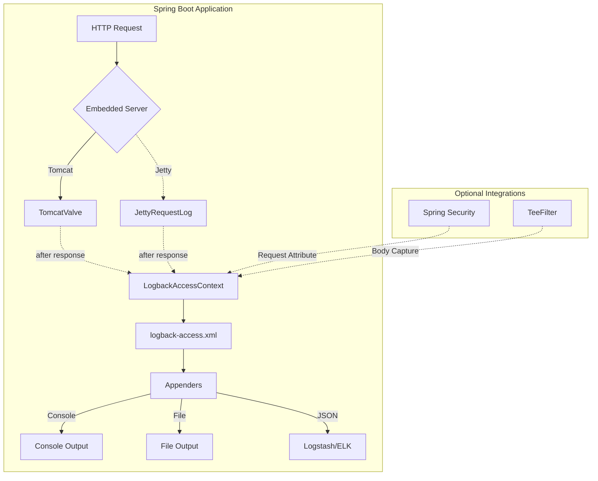
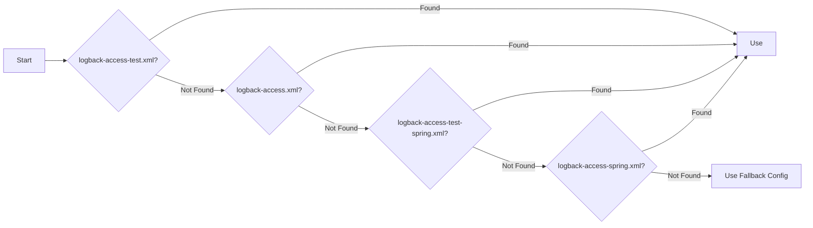
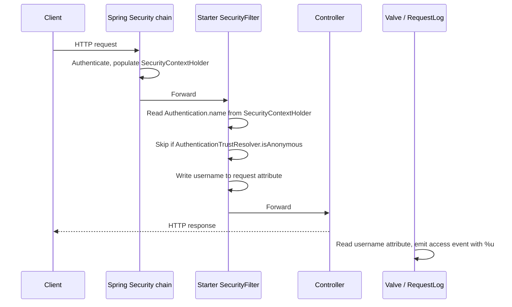
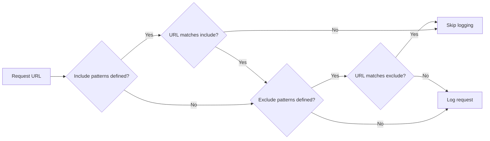

# Logback Access Spring Boot Starter

[](https://github.com/seijikohara/logback-access-spring-boot-starter/actions/workflows/test.yml)
[](https://central.sonatype.com/artifact/io.github.seijikohara/logback-access-spring-boot-starter)
[](https://seijikohara.github.io/logback-access-spring-boot-starter/)
[](https://www.apache.org/licenses/LICENSE-2.0)

<p align="center">
  
</p>

Spring Boot auto-configuration for [Logback Access](https://logback.qos.ch/access.html). The starter wires HTTP access logging into Tomcat and Jetty embedded servers, integrates with Spring Security and Spring profiles, and supports request/response body capture through Logback Access's TeeFilter.

## Architecture


```mermaid
flowchart TB
    subgraph app["Spring Boot Application"]
        direction TB
        A[HTTP Request] --> B{Embedded Server}
        B -->|Tomcat| C[TomcatValve]
        B -.->|Jetty| D[JettyRequestLog]
        C -.->|after response| E[LogbackAccessContext]
        D -.->|after response| E
        E --> F[logback-access.xml]
        F --> G[Appenders]
        G -->|Console| H[Console Output]
        G -->|File| I[File Output]
        G -->|JSON| J["Logstash/ELK"]
    end

    subgraph opt["Optional Integrations"]
        K[Spring Security] -.->|Request Attribute| E
        L[TeeFilter] -.->|Body Capture| E
    end
```

## Features

| Feature | Description |
|---------|-------------|
| **Auto-configuration** | Zero-configuration setup for Tomcat and Jetty embedded servers. |
| **Spring Security** | Writes the authenticated username to the `%u` log variable (Servlet only). |
| **TeeFilter** | Captures request and response bodies for `%requestContent` / `%responseContent` (Tomcat Servlet only). |
| **Spring Profiles** | Environment-specific configuration via `<springProfile>`. |
| **Spring Properties** | Injects values from the Spring `Environment` via `<springProperty>`. |
| **URL Filtering** | Regex-based include/exclude lists to control which URIs are logged. |

## Requirements

| Component | Version |
|-----------|---------|
| Java | 21 or later |
| Spring Boot | 4.0 or later |

## Installation

<details>
<summary><strong>Maven</strong></summary>

```xml
<dependency>
    <groupId>io.github.seijikohara</groupId>
    <artifactId>logback-access-spring-boot-starter</artifactId>
    <version>VERSION</version>
</dependency>
```
</details>

<details>
<summary><strong>Gradle (Kotlin DSL)</strong></summary>

```kotlin
implementation("io.github.seijikohara:logback-access-spring-boot-starter:VERSION")
```
</details>

<details>
<summary><strong>Gradle (Groovy DSL)</strong></summary>

```groovy
implementation 'io.github.seijikohara:logback-access-spring-boot-starter:VERSION'
```
</details>

## Quick Start

### Step 1: Add the Dependency

Pick the snippet that matches the build system (see [Installation](#installation) for all three formats):

```kotlin
implementation("io.github.seijikohara:logback-access-spring-boot-starter:VERSION")
```

### Step 2: Create the Configuration File

Create `src/main/resources/logback-access.xml`:

```xml
<?xml version="1.0" encoding="UTF-8"?>
<configuration>
    <appender name="console" class="ch.qos.logback.core.ConsoleAppender">
        <encoder>
            <pattern>%h %l %u [%t] "%r" %s %b</pattern>
        </encoder>
    </appender>
    <appender-ref ref="console"/>
</configuration>
```

### Step 3: Run the Application

Start the application and issue an HTTP request. Each request produces a log line on the console:

```
127.0.0.1 - - [06/Feb/2026:10:30:45 +0900] "GET /api/hello HTTP/1.1" 200 13
```

## Configuration

### Properties Reference

The most common properties are listed below. For the complete reference, see the [configuration guide](https://seijikohara.github.io/logback-access-spring-boot-starter/guide/configuration).

| Property | Description | Default |
|----------|-------------|---------|
| `logback.access.enabled` | Enable or disable access logging. | `true` |
| `logback.access.config-location` | Path to the configuration file. Supports `classpath:` and `file:` URL prefixes. | Auto-detected |
| `logback.access.local-port-strategy` | Port reported by `%p`: `server` (the port the client addressed) or `local` (the local interface port). | `server` |
| `logback.access.filter.include-url-patterns` | Java regex list; the request URI must match at least one entry to be logged. | All URIs |
| `logback.access.filter.exclude-url-patterns` | Java regex list; matching URIs are dropped. Exclude takes precedence over include. | None |

### Configuration File Resolution


```mermaid
flowchart LR
    A[Start] --> B{logback-access-test.xml?}
    B -->|Found| Z[Use]
    B -->|Not Found| C{logback-access.xml?}
    C -->|Found| Z
    C -->|Not Found| D{logback-access-test-spring.xml?}
    D -->|Found| Z
    D -->|Not Found| E{logback-access-spring.xml?}
    E -->|Found| Z
    E -->|Not Found| F[Use Fallback Config]
```

When `logback.access.config-location` is unset, the starter scans the classpath in the order above and loads the first file it finds. If none are present, it falls back to a configuration bundled with the starter that logs to the console in the `common` format. Setting `config-location` bypasses this resolution — the file must exist or the application fails to start.

### Log Pattern Elements

A subset of the most common conversion words is listed below. For the complete reference (cookies, attributes, body capture, query string, etc.), see the [pattern variables guide](https://seijikohara.github.io/logback-access-spring-boot-starter/guide/getting-started#pattern-variables).

| Conversion | Description | Example |
|------------|-------------|---------|
| `%h` | Remote host. On Jetty, always an IP address. | `127.0.0.1` |
| `%l` | Remote log name. Always `-`. | `-` |
| `%u` | Authenticated user name, or `-` when anonymous. | `admin` |
| `%t` | Request timestamp. | `06/Feb/2026:10:30:45 +0900` |
| `%r` | Request line (method, URI with query string, protocol). | `GET /api/hello HTTP/1.1` |
| `%s` | HTTP status code. | `200` |
| `%b` | Response body size in bytes. | `1234` |
| `%D` | Processing time in milliseconds. | `45` |
| `%T` | Processing time in seconds. | `0` |
| `%I` | Thread name that processed the request. | `http-nio-8080-exec-1` |
| `%{name}i` | Value of request header `name`. | `%{User-Agent}i` |

## Server Integration

### Tomcat

When Tomcat is on the classpath, the starter registers an Engine-level `Valve` implementing `AccessLog`. Tomcat invokes the valve after each request completes.

| Property | Description | Default |
|----------|-------------|---------|
| `logback.access.tomcat.request-attributes-enabled` | Honor `RemoteIpValve` access-log attributes (`org.apache.catalina.AccessLog.RemoteAddr`, etc.) so `%h`, `%a`, and `%p` reflect the forwarded client. | Auto-detected from the presence of `RemoteIpValve` |

### Jetty

When Jetty is on the classpath, the starter installs a `RequestLog` on the Jetty `Server`. Jetty invokes the `RequestLog` after each request completes.

> **Note**: Jetty 12 exposes `RequestLog` at the core server level, below the Servlet API. This breaks TeeFilter compatibility on Jetty — see [Known Limitations](#known-limitations).

## Advanced Features

### Spring Security Integration


```mermaid
sequenceDiagram
    participant Client
    participant SS as Spring Security chain
    participant SF as Starter SecurityFilter
    participant Controller
    participant AL as Valve / RequestLog

    Client->>SS: HTTP request
    SS->>SS: Authenticate, populate SecurityContextHolder
    SS->>SF: Forward
    SF->>SF: Read Authentication.name from SecurityContextHolder
    SF->>SF: Skip if AuthenticationTrustResolver.isAnonymous
    SF->>SF: Write username to request attribute
    SF->>Controller: Forward
    Controller-->>Client: HTTP response
    AL->>AL: Read username attribute, emit access event with %u
```

When Spring Security is on the classpath (Servlet only), the starter writes the authenticated user name to `%u`:

```
127.0.0.1 - admin [06/Feb/2026:10:30:45 +0900] "GET /api/secure HTTP/1.1" 200 14
```

No additional configuration is required. On reactive applications (Spring WebFlux), access logging still operates but `%u` always renders as `-`.

### TeeFilter (Body Capture)

> **Note**: TeeFilter is available on Servlet applications with Tomcat only. The starter does not register it on Jetty or on reactive applications (Spring WebFlux).

Enable TeeFilter to buffer request and response bodies:

```yaml
logback:
  access:
    tee-filter:
      enabled: true
```

Reference the captured bodies with `%requestContent` and `%responseContent`.

| Property | Description | Default |
|----------|-------------|---------|
| `logback.access.tee-filter.enabled` | Enable body capture. | `false` |
| `logback.access.tee-filter.include-hosts` | Comma-separated host names that activate the filter. | All hosts |
| `logback.access.tee-filter.exclude-hosts` | Comma-separated host names that bypass the filter. | None |
| `logback.access.tee-filter.max-payload-size` | Maximum payload size in bytes that appears in log output. Larger bodies are replaced with a sentinel. | `65536` |
| `logback.access.tee-filter.allowed-content-types` | Content-Type patterns allowed for body capture. When set, this list completely replaces the built-in defaults. | Text, JSON, and XML types ([details](https://seijikohara.github.io/logback-access-spring-boot-starter/guide/advanced#teefilter)) |

> **Security Warning**: Captured bodies can contain credentials, tokens, and personally identifiable information. Restrict the capture scope with `include-hosts` / `exclude-hosts`, and apply masking before the data leaves the host. Form submissions (`application/x-www-form-urlencoded`) and non-empty payloads without a `Content-Type` are suppressed unless explicitly added to `allowed-content-types`.
>
> Note also that `max-payload-size` only limits what reaches the log output — TeeFilter still buffers the full body in memory regardless.

For details on the body capture policy and platform compatibility, see the [advanced guide](https://seijikohara.github.io/logback-access-spring-boot-starter/guide/advanced#teefilter).

### URL Pattern Filtering

Filter access logs with Java regex patterns. Matching is **partial** — a pattern matches if it occurs anywhere in the request URI. Anchor with `^` and `$` for an exact match.

```yaml
logback:
  access:
    filter:
      include-url-patterns:
        - ^/api/.*
      exclude-url-patterns:
        - ^/actuator/.*
        - ^/health$
```

Evaluation order: a URI is logged only when it matches an include pattern (or no include list is defined) **and** matches no exclude pattern.


```mermaid
flowchart LR
    A[Request URL] --> B{Include patterns defined?}
    B -->|Yes| C{URL matches include?}
    B -->|No| D{Exclude patterns defined?}
    C -->|Yes| D
    C -->|No| E[Skip logging]
    D -->|Yes| F{URL matches exclude?}
    D -->|No| G[Log request]
    F -->|Yes| E
    F -->|No| G
```

### JSON Logging (Logstash/ELK)

For structured output suitable for log aggregation, add [logstash-logback-encoder](https://github.com/logfellow/logstash-logback-encoder):

```kotlin
implementation("net.logstash.logback:logstash-logback-encoder:9.0")
```

Configure `logback-access.xml` to use the access encoder:

```xml
<configuration>
    <appender name="json" class="ch.qos.logback.core.ConsoleAppender">
        <encoder class="net.logstash.logback.encoder.LogstashAccessEncoder"/>
    </appender>
    <appender-ref ref="json"/>
</configuration>
```

Sample output:

```json
{
  "@timestamp": "2026-02-06T10:30:45.123+09:00",
  "@version": "1",
  "message": "GET /api/hello HTTP/1.1",
  "method": "GET",
  "protocol": "HTTP/1.1",
  "status_code": 200,
  "requested_url": "GET /api/hello HTTP/1.1",
  "requested_uri": "/api/hello",
  "remote_host": "127.0.0.1",
  "remote_user": "-",
  "content_length": 13,
  "elapsed_time": 45
}
```

Attach static fields with `<customFields>`:

```xml
<encoder class="net.logstash.logback.encoder.LogstashAccessEncoder">
    <customFields>{"environment":"production","service":"api"}</customFields>
</encoder>
```

### Spring Profiles

Activate different appenders per environment with `<springProfile>`. The configuration file must be named `logback-access-spring.xml` (or `-test-spring.xml`) for the Spring extensions to apply.

```xml
<configuration>
    <springProfile name="dev">
        <appender name="console" class="ch.qos.logback.core.ConsoleAppender">
            <encoder>
                <pattern>%h %l %u [%t] "%r" %s %b %D</pattern>
            </encoder>
        </appender>
        <appender-ref ref="console"/>
    </springProfile>

    <springProfile name="prod">
        <appender name="file" class="ch.qos.logback.core.FileAppender">
            <file>/var/log/access.log</file>
            <encoder>
                <pattern>%h %l %u [%t] "%r" %s %b</pattern>
            </encoder>
        </appender>
        <appender-ref ref="file"/>
    </springProfile>
</configuration>
```

### Spring Properties

Inject values from the Spring `Environment` with `<springProperty>`:

```xml
<configuration>
    <springProperty name="appName" source="spring.application.name" defaultValue="app"/>

    <appender name="console" class="ch.qos.logback.core.ConsoleAppender">
        <encoder>
            <pattern>[${appName}] %h %l %u [%t] "%r" %s %b</pattern>
        </encoder>
    </appender>
    <appender-ref ref="console"/>
</configuration>
```

The default scope is `LOCAL`, which only resolves the value during XML parsing for variable substitution (`${appName}`). To read the value programmatically via `context.getProperty()`, set `scope="context"`:

```xml
<springProperty name="appName" source="spring.application.name" scope="context"/>
```

## Known Limitations

### TeeFilter on Jetty 12

The Jetty 12 `RequestLog` API operates at the core server level, below the Servlet container. TeeFilter writes its captured buffers as Servlet request attributes (`LB_INPUT_BUFFER` / `LB_OUTPUT_BUFFER`), which the Jetty `RequestLog` cannot read. As a result, `%requestContent` and `%responseContent` always render as empty on Jetty.

### Request Parameters on Jetty 12

On Jetty 12, the starter exposes `requestParameterMap` as an empty map. Calling `getParameter*` on a Jetty `Request` would consume the body for `application/x-www-form-urlencoded` requests, so the starter deliberately skips this path. Read the raw header with `%{Content-Type}i` instead, or switch to Tomcat if full parameter access is required.

### Remote Host on Jetty 12

Jetty does not perform reverse DNS lookups. `%h` always renders the IP address (the same value as `%a`).

## Examples

The [examples/](examples/) directory contains runnable Spring Boot applications used as the project's integration tests:

| Module | Server | Framework | Notes |
|--------|--------|-----------|-------|
| `tomcat-mvc` | Tomcat | Spring MVC | Full feature coverage, including TeeFilter and Spring Security. |
| `jetty-mvc` | Jetty | Spring MVC | Full feature coverage except TeeFilter. |
| `tomcat-webflux` | Tomcat | WebFlux | Reactive endpoints; `%u` always renders as `-`. |
| `jetty-webflux` | Jetty | WebFlux | Reactive endpoints; `%u` always renders as `-`. |

## Module Structure

The library is published as two Maven artifacts:

| Artifact | Automatic-Module-Name (JPMS) | Description |
|----------|------------------------------|-------------|
| `logback-access-spring-boot-starter` | `io.github.seijikohara.logback.access.spring` | Auto-configuration and server integrations (Tomcat, Jetty, Spring Security, TeeFilter). |
| `logback-access-spring-boot-starter-core` | `io.github.seijikohara.logback.access.core` | Public API and data models. Pulled in transitively. Declare it separately only when extending the API. |

In typical use, declare only the starter:

```kotlin
implementation("io.github.seijikohara:logback-access-spring-boot-starter:$version")
```

## Acknowledgments

This project was inspired by [akkinoc/logback-access-spring-boot-starter](https://github.com/akkinoc/logback-access-spring-boot-starter). When Spring Boot 4.0 introduced breaking changes, this project was created as an independent implementation targeting the new major version.

## License

Apache License, Version 2.0. See [LICENSE](LICENSE) for details.
