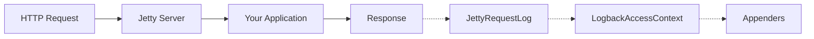

# Jetty Integration

This page describes Jetty-specific configuration and behavior.

## How It Works

When Jetty is the embedded server, the starter installs a custom `RequestLog` on the Jetty `Server`. Jetty invokes the `RequestLog` after each request completes, and the starter emits the access event through the configured appenders.



## Using Jetty

Replace Spring Boot's default Tomcat with Jetty:

::: code-group

```kotlin [Gradle (Kotlin)]
implementation("org.springframework.boot:spring-boot-starter-webmvc") {
    exclude(group = "org.springframework.boot", module = "spring-boot-starter-tomcat")
}
implementation("org.springframework.boot:spring-boot-starter-jetty")
implementation("io.github.seijikohara:logback-access-spring-boot-starter:VERSION")
```

```groovy [Gradle (Groovy)]
implementation('org.springframework.boot:spring-boot-starter-webmvc') {
    exclude group: 'org.springframework.boot', module: 'spring-boot-starter-tomcat'
}
implementation 'org.springframework.boot:spring-boot-starter-jetty'
implementation 'io.github.seijikohara:logback-access-spring-boot-starter:VERSION'
```

```xml [Maven]
<dependency>
    <groupId>org.springframework.boot</groupId>
    <artifactId>spring-boot-starter-webmvc</artifactId>
    <exclusions>
        <exclusion>
            <groupId>org.springframework.boot</groupId>
            <artifactId>spring-boot-starter-tomcat</artifactId>
        </exclusion>
    </exclusions>
</dependency>
<dependency>
    <groupId>org.springframework.boot</groupId>
    <artifactId>spring-boot-starter-jetty</artifactId>
</dependency>
<dependency>
    <groupId>io.github.seijikohara</groupId>
    <artifactId>logback-access-spring-boot-starter</artifactId>
    <version>VERSION</version>
</dependency>
```

:::

## Jetty 12 Compatibility

This library targets Jetty 12, the version bundled with Spring Boot 4.

## Pattern Variables

For the full pattern variable reference, see [Getting Started — Pattern Variables](/guide/getting-started#pattern-variables).

Jetty-specific behavior:

- **Cookies** (`%{name}c`): the starter reads cookies via Jetty's `Request.getCookies()`.
- **Request attributes** (`%{name}r`): standard servlet attributes are exposed; Tomcat-specific `AccessLog` attributes (e.g., `org.apache.catalina.AccessLog.RemoteAddr`) are not available.
- **Remote host** (`%h`): always renders the IP address. Jetty does not perform reverse DNS lookups.
- **Request parameters**: always exposed as an empty map to avoid consuming the request body.

## Known Limitations

### Remote Host Resolution

Jetty does not perform reverse DNS lookups. `%h` always renders an IP address.

### Request Parameters

The starter exposes `requestParameterMap` as an empty map. Calling `getParameter*` on a Jetty `Request` would consume the body for `application/x-www-form-urlencoded` requests, so the starter deliberately skips this path.

### TeeFilter

::: warning Not supported on Jetty 12
The Jetty 12 `RequestLog` API operates at the core server level, below the Servlet container. TeeFilter writes its captured buffers as Servlet request attributes, which the Jetty `RequestLog` cannot read. See [Advanced Topics — TeeFilter](/guide/advanced#teefilter) for TeeFilter usage on Tomcat.
:::

## Local Port Strategy

Choose which port the `%p` variable reports:

```yaml
logback:
  access:
    local-port-strategy: server  # or 'local'
```

- `server`: the port the client addressed (typically derived from the `Host` header or forwarded headers).
- `local`: the port of the local interface that accepted the connection.

## Behind a Reverse Proxy

Configure Jetty to honor forwarded headers:

```yaml
server:
  forward-headers-strategy: native
```

Or, to use Spring's `ForwardedHeaderFilter` instead:

```yaml
server:
  forward-headers-strategy: framework
```

## Spring Security Integration

When Spring Security is on the classpath (Servlet only), the starter writes the authenticated username to `%u`. See [Advanced Topics — Spring Security Integration](/guide/advanced#spring-security-integration) for details. On reactive applications (Spring WebFlux on Jetty), `%u` always renders as `-`.

## Example Configuration

A production-style configuration for Jetty that writes to a rolling file and excludes operational endpoints:

```xml
<?xml version="1.0" encoding="UTF-8"?>
<configuration>
    <appender name="file" class="ch.qos.logback.core.rolling.RollingFileAppender">
        <file>logs/access.log</file>
        <rollingPolicy class="ch.qos.logback.core.rolling.TimeBasedRollingPolicy">
            <fileNamePattern>logs/access.%d{yyyy-MM-dd}.log.gz</fileNamePattern>
            <maxHistory>30</maxHistory>
        </rollingPolicy>
        <encoder>
            <pattern>%h %l %u [%t] "%r" %s %b "%{Referer}i" "%{User-Agent}i" %D</pattern>
        </encoder>
    </appender>

    <appender-ref ref="file"/>
</configuration>
```

Application properties:

```yaml
logback:
  access:
    filter:
      exclude-url-patterns:
        - /actuator/.*
        - /health
```

## See Also

- [Configuration Reference](/guide/configuration) — Full property reference and XML configuration.
- [Advanced Topics](/guide/advanced) — TeeFilter, URL filtering, JSON logging, and Spring Security.
