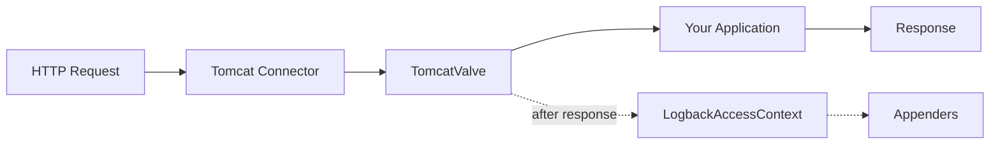

# Tomcat Integration

This page describes Tomcat-specific configuration and behavior.

## How It Works

When Tomcat is the embedded server, the starter registers an Engine-level `Valve` that implements `AccessLog`. Tomcat invokes the valve after each request completes, and the starter emits the access event through the configured appenders.



## Tomcat-Specific Properties

```yaml
logback:
  access:
    tomcat:
      # Auto-detected from the presence of RemoteIpValve when not set
      request-attributes-enabled: true
```

| Property | Default | Description |
|----------|---------|-------------|
| `logback.access.tomcat.request-attributes-enabled` | Auto-detected | Honor `RemoteIpValve` access-log attributes. When unset, the starter enables this automatically if a `RemoteIpValve` is present in the pipeline. |

### Request Attributes

When `request-attributes-enabled` is `true`, the starter consults the following Tomcat access-log attributes (typically set by `RemoteIpValve`) instead of the raw connection values, so the access log reflects the client side of a reverse proxy:

| Attribute | Affects | Description |
|-----------|---------|-------------|
| `org.apache.catalina.AccessLog.RemoteAddr` | `%h`, `%a` | Forwarded client IP address. |
| `org.apache.catalina.AccessLog.RemoteHost` | `%h` (when present) | Forwarded client hostname. |
| `org.apache.catalina.AccessLog.Protocol` | `%H`, `%r` | Forwarded protocol (e.g., `https`). |
| `org.apache.catalina.AccessLog.ServerName` | Server name | Forwarded server name from the `Host` header. |
| `org.apache.catalina.AccessLog.ServerPort` | `%p` (under `server` strategy) | Forwarded server port. |

When `request-attributes-enabled` is unset, the starter auto-enables it if a `RemoteIpValve` is detected in the Tomcat pipeline.

## Pattern Variables

For the full pattern variable reference, see [Getting Started — Pattern Variables](/guide/getting-started#pattern-variables).

Arbitrary request attributes can also be read with the generic `%{name}r` converter (for example, `%{org.apache.catalina.AccessLog.RemoteAddr}r`). The five attributes listed above are additionally consulted internally to derive the standard variables.

## Elapsed Time

The `%D` and `%T` pattern variables report the request processing time. Tomcat's `AccessLog.log(request, response, time)` contract delivers the value in nanoseconds; the starter converts it to milliseconds before storing. If Tomcat does not supply a value, the starter falls back to `System.currentTimeMillis() - request.coyoteRequest.startTime`.

## Behind a Reverse Proxy

When the application sits behind a proxy (nginx, Apache, a load balancer), enable Spring Boot's `RemoteIpValve` so that `%h` and related variables reflect the original client:

```yaml
server:
  tomcat:
    remoteip:
      remote-ip-header: X-Forwarded-For
      protocol-header: X-Forwarded-Proto
```

The starter auto-detects the valve and starts honoring its access-log attributes. The access log then reports the forwarded client address instead of the proxy's address.

## Local Port Strategy

Choose which port the `%p` variable reports:

```yaml
logback:
  access:
    local-port-strategy: server  # or 'local'
```

- `server`: the port the client addressed. With `RemoteIpValve` and `request-attributes-enabled`, this honors `X-Forwarded-Port`.
- `local`: the port of the local interface that accepted the connection.

## Spring Security Integration

When Spring Security is on the classpath (Servlet only), the starter writes the authenticated username to `%u`:

```xml
<pattern>%h %l %u [%t] "%r" %s %b</pattern>
```

The `%u` variable renders as:

- the authenticated username, or
- `-` for anonymous requests.

See [Advanced Topics — Spring Security Integration](/guide/advanced#spring-security-integration) for details. On reactive applications (Spring WebFlux on Tomcat), `%u` always renders as `-`.

## Example Configuration

A production-style configuration that writes to a rolling file with the application name prefixed and excludes high-frequency operational endpoints:

```xml
<?xml version="1.0" encoding="UTF-8"?>
<configuration>
    <springProperty name="appName" source="spring.application.name"
                    defaultValue="app" scope="context"/>

    <appender name="file" class="ch.qos.logback.core.rolling.RollingFileAppender">
        <file>logs/access.log</file>
        <rollingPolicy class="ch.qos.logback.core.rolling.TimeBasedRollingPolicy">
            <fileNamePattern>logs/access.%d{yyyy-MM-dd}.log.gz</fileNamePattern>
            <maxHistory>30</maxHistory>
        </rollingPolicy>
        <encoder>
            <pattern>%h %l %u [%t] "%r" %s %b "%{Referer}i" "%{User-Agent}i" %D</pattern>
        </encoder>
    </appender>

    <appender-ref ref="file"/>
</configuration>
```

Application properties:

```yaml
logback:
  access:
    tomcat:
      request-attributes-enabled: true
    filter:
      exclude-url-patterns:
        - /actuator/.*
        - /health
        - /favicon.ico
```

## See Also

- [Configuration Reference](/guide/configuration) — Full property reference and XML configuration.
- [Advanced Topics](/guide/advanced) — TeeFilter, URL filtering, JSON logging, and Spring Security.
