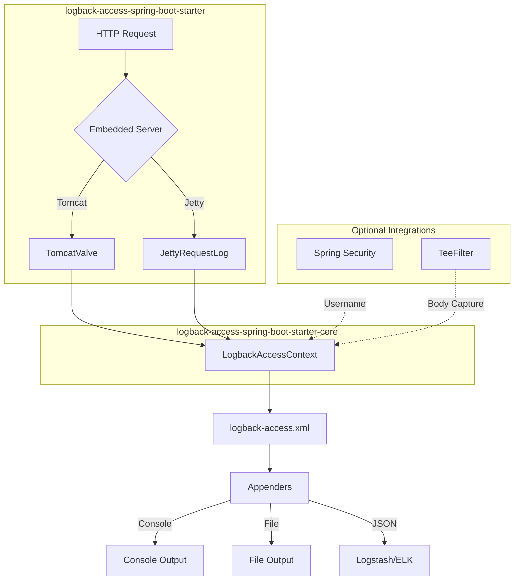

## Architecture



## Quick Start

Add the dependency to your project:

> Replace `VERSION` with the [latest version from Maven Central](https://central.sonatype.com/artifact/io.github.seijikohara/logback-access-spring-boot-starter).

::: code-group

```kotlin [Gradle (Kotlin)]
implementation("io.github.seijikohara:logback-access-spring-boot-starter:VERSION")
```

```groovy [Gradle (Groovy)]
implementation 'io.github.seijikohara:logback-access-spring-boot-starter:VERSION'
```

```xml [Maven]
<dependency>
    <groupId>io.github.seijikohara</groupId>
    <artifactId>logback-access-spring-boot-starter</artifactId>
    <version>VERSION</version>
</dependency>
```

:::

Create `src/main/resources/logback-access.xml`:

```xml
<?xml version="1.0" encoding="UTF-8"?>
<configuration>
    <appender name="console" class="ch.qos.logback.core.ConsoleAppender">
        <encoder>
            <pattern>%h %l %u [%t] "%r" %s %b</pattern>
        </encoder>
    </appender>
    <appender-ref ref="console"/>
</configuration>
```

Start your application and access logs will appear in the console.

## Requirements

| Component | Version |
|-----------|---------|
| Java | 21+ |
| Spring Boot | 4.0+ |

## License

This project is licensed under the [Apache License 2.0](https://www.apache.org/licenses/LICENSE-2.0).
