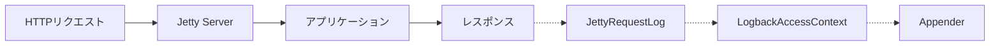

# Jetty連携

このページでは、Jetty固有の設定と動作を説明します。

## 動作の仕組み

組み込みサーバーがJettyの場合、スターターはJettyの`Server`にカスタム`RequestLog`を設定します。リクエスト完了後にJettyがこの`RequestLog`を呼び出すと、スターターは設定済みのAppenderを通じてアクセスイベントを出力します。



## Jettyの使用

Spring Bootのデフォルトの組み込みTomcatをJettyに置き換えます。

::: code-group

```kotlin [Gradle (Kotlin)]
implementation("org.springframework.boot:spring-boot-starter-webmvc") {
    exclude(group = "org.springframework.boot", module = "spring-boot-starter-tomcat")
}
implementation("org.springframework.boot:spring-boot-starter-jetty")
implementation("io.github.seijikohara:logback-access-spring-boot-starter:VERSION")
```

```groovy [Gradle (Groovy)]
implementation('org.springframework.boot:spring-boot-starter-webmvc') {
    exclude group: 'org.springframework.boot', module: 'spring-boot-starter-tomcat'
}
implementation 'org.springframework.boot:spring-boot-starter-jetty'
implementation 'io.github.seijikohara:logback-access-spring-boot-starter:VERSION'
```

```xml [Maven]
<dependency>
    <groupId>org.springframework.boot</groupId>
    <artifactId>spring-boot-starter-webmvc</artifactId>
    <exclusions>
        <exclusion>
            <groupId>org.springframework.boot</groupId>
            <artifactId>spring-boot-starter-tomcat</artifactId>
        </exclusion>
    </exclusions>
</dependency>
<dependency>
    <groupId>org.springframework.boot</groupId>
    <artifactId>spring-boot-starter-jetty</artifactId>
</dependency>
<dependency>
    <groupId>io.github.seijikohara</groupId>
    <artifactId>logback-access-spring-boot-starter</artifactId>
    <version>VERSION</version>
</dependency>
```

:::

## Jetty 12互換性

このライブラリはSpring Boot 4に同梱されるJetty 12を対象としています。

## パターン変数

全パターン変数のリファレンスは[はじめに — パターン変数](/ja/guide/getting-started#パターン変数)を参照してください。

Jetty固有の動作:

- **Cookie** (`%{name}c`): スターターはJettyの`Request.getCookies()`からCookieを取得します。
- **リクエスト属性** (`%{name}r`): 標準のServlet属性は参照可能ですが、Tomcat固有の`AccessLog`属性（例: `org.apache.catalina.AccessLog.RemoteAddr`）は利用できません。
- **リモートホスト** (`%h`): 常にIPアドレスを返します。Jettyは逆引きDNSルックアップを実行しません。
- **リクエストパラメータ**: 常に空のマップとして公開します。リクエストボディの消費を避けるための意図的な動作です。

## 既知の制限事項

### リモートホスト解決

Jettyは逆引きDNSルックアップを実行しません。`%h`は常にIPアドレスを返します。

### リクエストパラメータ

スターターは`requestParameterMap`を空のマップとして公開します。Jettyの`Request`に対して`getParameter*`を呼び出すと、`application/x-www-form-urlencoded`リクエストではボディが消費されるため、この経路を意図的に回避しています。

### TeeFilter

::: warning Jetty 12では非対応
Jetty 12の`RequestLog` APIはServletコンテナよりも下のコアサーバーレベルで動作します。TeeFilterはキャプチャしたバッファをServletリクエスト属性として書き込みますが、Jettyの`RequestLog`はそれを参照できません。TomcatでのTeeFilter利用方法は[高度な設定 — TeeFilter](/ja/guide/advanced#teefilter)を参照してください。
:::

## ローカルポート戦略

`%p`変数が報告するポートを選択します。

```yaml
logback:
  access:
    local-port-strategy: server  # または 'local'
```

- `server`: クライアントが指定したポート（通常は`Host`ヘッダーまたは転送ヘッダーから導出される）。
- `local`: 接続を受け付けたローカルインターフェースのポート。

## リバースプロキシの背後での使用

転送ヘッダーをJettyに反映させます。

```yaml
server:
  forward-headers-strategy: native
```

または、Springの`ForwardedHeaderFilter`を使う場合:

```yaml
server:
  forward-headers-strategy: framework
```

## Spring Security連携

Spring Securityがクラスパスにある場合（Servlet限定）、スターターは認証済みユーザー名を`%u`に書き込みます。詳細は[高度な設定 — Spring Security連携](/ja/guide/advanced#spring-security連携)を参照してください。リアクティブアプリケーション（Jetty上のSpring WebFlux）では、`%u`は常に`-`を表示します。

## 設定例

ローテーションファイルに出力し、運用エンドポイントを除外するJetty向けの本番設定例:

```xml
<?xml version="1.0" encoding="UTF-8"?>
<configuration>
    <appender name="file" class="ch.qos.logback.core.rolling.RollingFileAppender">
        <file>logs/access.log</file>
        <rollingPolicy class="ch.qos.logback.core.rolling.TimeBasedRollingPolicy">
            <fileNamePattern>logs/access.%d{yyyy-MM-dd}.log.gz</fileNamePattern>
            <maxHistory>30</maxHistory>
        </rollingPolicy>
        <encoder>
            <pattern>%h %l %u [%t] "%r" %s %b "%{Referer}i" "%{User-Agent}i" %D</pattern>
        </encoder>
    </appender>

    <appender-ref ref="file"/>
</configuration>
```

アプリケーションプロパティ:

```yaml
logback:
  access:
    filter:
      exclude-url-patterns:
        - /actuator/.*
        - /health
```

## 関連ページ

- [設定リファレンス](/ja/guide/configuration) — 全プロパティリファレンスとXML設定。
- [高度な設定](/ja/guide/advanced) — TeeFilter、URLフィルタリング、JSONロギング、Spring Security。
