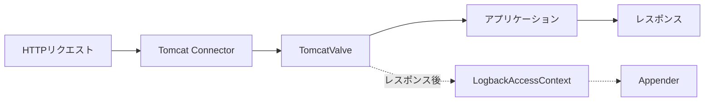

# Tomcat連携

このページでは、Tomcat固有の設定と動作を説明します。

## 動作の仕組み

組み込みサーバーがTomcatの場合、スターターは`AccessLog`を実装したEngineレベルの`Valve`を登録します。リクエスト完了後にTomcatがこのValveを呼び出すと、スターターは設定済みのAppenderを通じてアクセスイベントを出力します。



## Tomcat固有のプロパティ

```yaml
logback:
  access:
    tomcat:
      # 未設定時、RemoteIpValveの存在から自動判定
      request-attributes-enabled: true
```

| プロパティ | デフォルト | 説明 |
|-----------|----------|------|
| `logback.access.tomcat.request-attributes-enabled` | 自動検出 | `RemoteIpValve`が設定するアクセスログ属性を反映する。未設定時、パイプラインに`RemoteIpValve`が存在すれば自動的に有効化する。 |

### リクエスト属性

`request-attributes-enabled`が`true`のとき、スターターは生の接続値ではなく以下のTomcatアクセスログ属性（通常は`RemoteIpValve`が設定）を参照します。これによりリバースプロキシ越しのクライアント情報がアクセスログに反映されます。

| 属性 | 影響する変数 | 説明 |
|------|------------|------|
| `org.apache.catalina.AccessLog.RemoteAddr` | `%h`, `%a` | 転送されたクライアントIPアドレス。 |
| `org.apache.catalina.AccessLog.RemoteHost` | `%h`（存在時） | 転送されたクライアントホスト名。 |
| `org.apache.catalina.AccessLog.Protocol` | `%H`, `%r` | 転送されたプロトコル（例: `https`）。 |
| `org.apache.catalina.AccessLog.ServerName` | サーバー名 | `Host`ヘッダーから転送されたサーバー名。 |
| `org.apache.catalina.AccessLog.ServerPort` | `%p`（`server`戦略時） | 転送されたサーバーポート。 |

`request-attributes-enabled`を未設定にすると、Tomcatのパイプラインから`RemoteIpValve`を検出した場合に自動的に有効化されます。

## パターン変数

全パターン変数のリファレンスは[はじめに — パターン変数](/ja/guide/getting-started#パターン変数)を参照してください。

任意のリクエスト属性は汎用変換ワード`%{name}r`で読み出せます（例: `%{org.apache.catalina.AccessLog.RemoteAddr}r`）。上表の5つの属性は加えて、標準変数を導出するためにスターター内部でも参照されます。

## 経過時間

`%D`と`%T`はリクエスト処理時間を出力します。Tomcatの`AccessLog.log(request, response, time)`コントラクトはナノ秒単位で値を提供するため、スターターはこれをミリ秒に変換して保存します。Tomcatから値が提供されない場合、`System.currentTimeMillis() - request.coyoteRequest.startTime`から算出します。

## リバースプロキシの背後での使用

アプリケーションがプロキシ（nginx、Apache、ロードバランサー）の背後にある場合、Spring Bootの`RemoteIpValve`を有効化し、`%h`などの変数が元のクライアントを反映するようにします。

```yaml
server:
  tomcat:
    remoteip:
      remote-ip-header: X-Forwarded-For
      protocol-header: X-Forwarded-Proto
```

スターターはValveを自動検出し、そのアクセスログ属性を反映するようになります。これによりアクセスログにはプロキシではなく転送されたクライアントアドレスが記録されます。

## ローカルポート戦略

`%p`変数が報告するポートを選択します。

```yaml
logback:
  access:
    local-port-strategy: server  # または 'local'
```

- `server`: クライアントが指定したポート。`RemoteIpValve`と`request-attributes-enabled`を併用した場合、`X-Forwarded-Port`を反映する。
- `local`: 接続を受け付けたローカルインターフェースのポート。

## Spring Security連携

Spring Securityがクラスパスにある場合（Servlet限定）、スターターは認証済みユーザー名を`%u`に書き込みます。

```xml
<pattern>%h %l %u [%t] "%r" %s %b</pattern>
```

`%u`変数の出力:

- 認証済みユーザー名、または
- 匿名リクエストでは`-`。

詳細は[高度な設定 — Spring Security連携](/ja/guide/advanced#spring-security連携)を参照してください。リアクティブアプリケーション（Tomcat上のSpring WebFlux）では、`%u`は常に`-`を表示します。

## 設定例

アプリケーション名をプレフィックスとしてローテーションファイルに出力し、運用エンドポイントを除外する本番向け設定例:

```xml
<?xml version="1.0" encoding="UTF-8"?>
<configuration>
    <springProperty name="appName" source="spring.application.name"
                    defaultValue="app" scope="context"/>

    <appender name="file" class="ch.qos.logback.core.rolling.RollingFileAppender">
        <file>logs/access.log</file>
        <rollingPolicy class="ch.qos.logback.core.rolling.TimeBasedRollingPolicy">
            <fileNamePattern>logs/access.%d{yyyy-MM-dd}.log.gz</fileNamePattern>
            <maxHistory>30</maxHistory>
        </rollingPolicy>
        <encoder>
            <pattern>%h %l %u [%t] "%r" %s %b "%{Referer}i" "%{User-Agent}i" %D</pattern>
        </encoder>
    </appender>

    <appender-ref ref="file"/>
</configuration>
```

アプリケーションプロパティ:

```yaml
logback:
  access:
    tomcat:
      request-attributes-enabled: true
    filter:
      exclude-url-patterns:
        - /actuator/.*
        - /health
        - /favicon.ico
```

## 関連ページ

- [設定リファレンス](/ja/guide/configuration) — 全プロパティリファレンスとXML設定。
- [高度な設定](/ja/guide/advanced) — TeeFilter、URLフィルタリング、JSONロギング、Spring Security。
