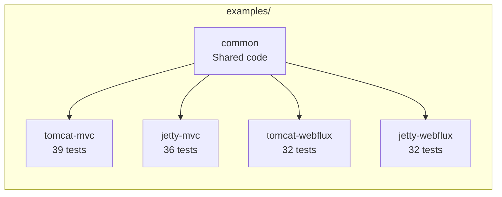
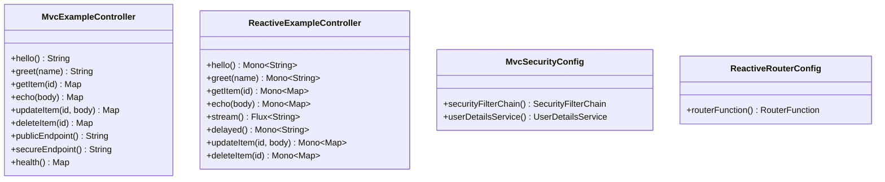
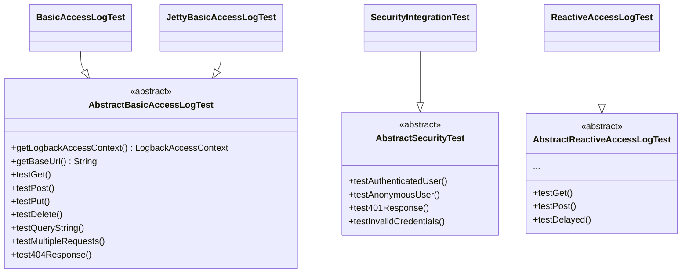
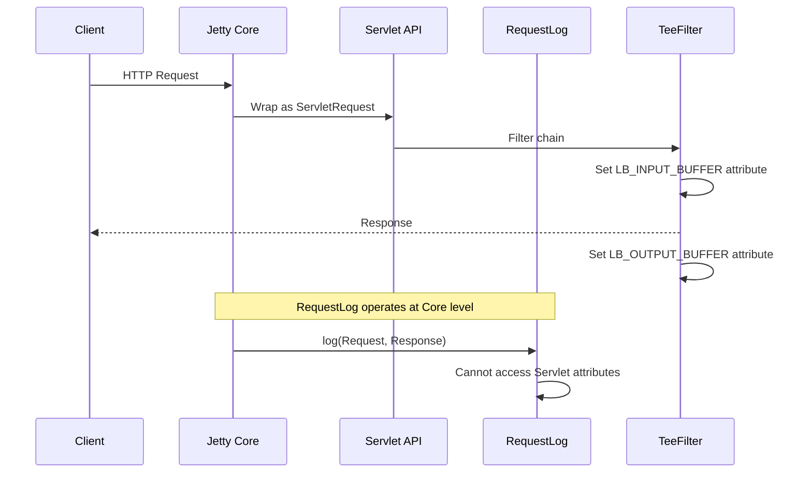

# Examples

Sample projects demonstrating logback-access-spring-boot-starter features. Each module serves as an integration test to verify library functionality.

## Project Structure



| Module | Server | Framework | Tests | Description |
|--------|--------|-----------|-------|-------------|
| `common` | - | - | - | Shared controllers, configs, and test utilities |
| `tomcat-mvc` | Tomcat | Spring MVC | 39 | Full feature coverage |
| `jetty-mvc` | Jetty | Spring MVC | 36 | Full feature coverage (TeeFilter disabled) |
| `tomcat-webflux` | Tomcat | WebFlux | 32 | Reactive endpoint coverage |
| `jetty-webflux` | Jetty | WebFlux | 32 | Reactive endpoint coverage |

**Total: 139 active tests** (4 TeeFilter tests skipped on Jetty)

## Common Module

The `common` module provides shared code to eliminate duplication across example projects.

### Shared Application Code



| Package | Class | Description |
|---------|-------|-------------|
| `mvc` | `MvcExampleController` | REST controller for MVC examples |
| `mvc` | `MvcSecurityConfig` | Spring Security configuration |
| `webflux` | `ReactiveExampleController` | Reactive REST controller |
| `webflux` | `ReactiveRouterConfig` | RouterFunction configuration |

### Abstract Base Test Classes



| Package | Class | Tests | Description |
|---------|-------|-------|-------------|
| (root) | `AbstractBasicAccessLogTest` | 7 | HTTP method tests |
| (root) | `AbstractSecurityTest` | 4 | Spring Security integration |
| `test.mvc` | `AbstractTeeFilterTest` | 4 | Request/response body capture |
| `test.mvc` | `AbstractLocalPortStrategyTest` | 2 | Port resolution strategy |
| `test.common` | `AbstractJsonLoggingTest` | 4 | LogstashAccessEncoder |
| `test.common` | `AbstractSpringPropertyScopeTest` | 3 | springProperty scope |
| `test.common` | `AbstractDisabledAccessLogTest` | 2 | Disabled configuration |
| `test.webflux` | `AbstractReactiveAccessLogTest` | 9 | Reactive endpoint tests |
| `test.webflux` | `AbstractReactiveLocalPortStrategyTest` | 2 | Port resolution strategy |
| `test.webflux` | `AbstractRouterFunctionTest` | 2 | RouterFunction tests |

### Test Utilities

| Class | Description |
|-------|-------------|
| `HttpClientTestUtils` | HTTP client wrapper with Basic auth support |
| `AccessEventTestUtils` | Access event retrieval with polling |

## Requirements

| Component | Version |
|-----------|---------|
| Java | 21+ |
| Gradle | 8.x |

## Running Tests

### All Modules

```bash
./gradlew :examples:tomcat-mvc:test :examples:jetty-mvc:test \
          :examples:tomcat-webflux:test :examples:jetty-webflux:test
```

### Specific Module

```bash
./gradlew :examples:tomcat-mvc:test
./gradlew :examples:jetty-mvc:test
```

### Specific Test Class

```bash
./gradlew :examples:tomcat-mvc:test --tests "*BasicAccessLogTest*"
./gradlew :examples:tomcat-mvc:test --tests "*SecurityIntegrationTest*"
```

## Feature Coverage

| Feature | Tomcat MVC | Jetty MVC | Tomcat WebFlux | Jetty WebFlux |
|---------|:----------:|:---------:|:--------------:|:-------------:|
| Basic HTTP Methods | ✓ | ✓ | ✓ | ✓ |
| Query String | ✓ | ✓ | ✓ | ✓ |
| Path Variables | ✓ | ✓ | ✓ | ✓ |
| 404 Response | ✓ | ✓ | ✓ | ✓ |
| Spring Security | ✓ | ✓ | - | - |
| TeeFilter | ✓ | ✗ | - | - |
| LocalPortStrategy | ✓ | ✓ | ✓ | ✓ |
| URL Filtering | ✓ | ✓ | ✓ | ✓ |
| JSON Logging | ✓ | ✓ | ✓ | ✓ |
| Spring Profiles | ✓ | ✓ | ✓ | ✓ |
| springProperty | ✓ | ✓ | ✓ | ✓ |
| Disabled Config | ✓ | ✓ | ✓ | ✓ |
| RouterFunction | - | - | ✓ | ✓ |
| Delayed Response | - | - | ✓ | ✓ |

**Legend**: ✓ = Supported | ✗ = Not supported | - = Not applicable

## Jetty Limitations

### TeeFilter

TeeFilter is not supported on Jetty 12. The architectural reason:



The Jetty 12 RequestLog API operates at the core server level, separate from the Servlet API. TeeFilter sets `LB_INPUT_BUFFER`/`LB_OUTPUT_BUFFER` attributes on the Servlet request, but these attributes are not visible to the RequestLog.

## Test Classes by Module

### Tomcat MVC (39 tests)

| Test Class | Tests | Description |
|------------|-------|-------------|
| `BasicAccessLogTest` | 9 | Access log emission + path variable |
| `SecurityIntegrationTest` | 5 | Spring Security integration |
| `TeeFilterTest` | 4 | Request/response body capture |
| `LocalPortStrategyTest` | 2 | Port resolution strategy |
| `UrlFilteringTest` | 6 | URL pattern filtering |
| `JsonLoggingTest` | 4 | JSON logging |
| `SpringProfileTest` | 4 | Profile-specific appenders |
| `SpringPropertyScopeTest` | 3 | springProperty scope |
| `DisabledAccessLogTest` | 2 | Disabled state |

### Jetty MVC (36 tests, 4 skipped)

| Test Class | Tests | Description |
|------------|-------|-------------|
| `JettyBasicAccessLogTest` | 7 | Access log emission |
| `JettySecurityTest` | 4 | Spring Security integration |
| `JettyTeeFilterTest` | 4 (skipped) | Disabled - TeeFilter not supported |
| `JettyLocalPortStrategyTest` | 2 | Port resolution strategy |
| `JettyUrlFilteringTest` | 6 | URL pattern filtering |
| `JettyJsonLoggingTest` | 4 | JSON logging |
| `JettySpringProfileTest` | 4 | Profile-specific appenders |
| `JettySpringPropertyScopeTest` | 3 | springProperty scope |
| `JettyDisabledAccessLogTest` | 2 | Disabled state |

### Tomcat WebFlux (32 tests)

| Test Class | Tests | Description |
|------------|-------|-------------|
| `ReactiveAccessLogTest` | 9 | Reactive endpoint logging |
| `RouterFunctionTest` | 2 | RouterFunction logging |
| `UrlFilteringTest` | 6 | URL pattern filtering |
| `LocalPortStrategyTest` | 2 | Port resolution strategy |
| `JsonLoggingTest` | 4 | JSON logging |
| `SpringProfileTest` | 4 | Profile-specific appenders |
| `SpringPropertyScopeTest` | 3 | springProperty scope |
| `DisabledAccessLogTest` | 2 | Disabled state |

### Jetty WebFlux (32 tests)

| Test Class | Tests | Description |
|------------|-------|-------------|
| `ReactiveAccessLogTest` | 9 | Reactive endpoint logging |
| `RouterFunctionTest` | 2 | RouterFunction logging |
| `UrlFilteringTest` | 6 | URL pattern filtering |
| `LocalPortStrategyTest` | 2 | Port resolution strategy |
| `JsonLoggingTest` | 4 | JSON logging |
| `SpringProfileTest` | 4 | Profile-specific appenders |
| `SpringPropertyScopeTest` | 3 | springProperty scope |
| `DisabledAccessLogTest` | 2 | Disabled state |

## Log Output Examples

### Configuration

Common Log Format (CLF) pattern in `logback-access.xml`:

```xml
<configuration>
    <appender name="console" class="ch.qos.logback.core.ConsoleAppender">
        <encoder>
            <pattern>%h %l %u [%t] "%r" %s %b</pattern>
        </encoder>
    </appender>
    <appender-ref ref="console"/>
</configuration>
```

### Pattern Elements

| Conversion | Description | Example |
|------------|-------------|---------|
| `%h` | Remote host | `127.0.0.1` |
| `%l` | Remote log name | `-` |
| `%u` | Authenticated user | `admin` |
| `%t` | Timestamp | `06/Feb/2026:15:30:45 +0900` |
| `%r` | Request line | `GET /api/hello HTTP/1.1` |
| `%s` | Status code | `200` |
| `%b` | Response size | `13` |

### Output Examples

```
# Basic GET
127.0.0.1 - - [06/Feb/2026:15:30:45 +0900] "GET /api/hello HTTP/1.1" 200 13

# GET with Query String
127.0.0.1 - - [06/Feb/2026:15:30:46 +0900] "GET /api/greet?name=Alice HTTP/1.1" 200 14

# POST (JSON Body)
127.0.0.1 - - [06/Feb/2026:15:30:47 +0900] "POST /api/echo HTTP/1.1" 200 27

# Authenticated User
127.0.0.1 - admin [06/Feb/2026:15:30:50 +0900] "GET /api/secure HTTP/1.1" 200 14

# 404 Not Found
127.0.0.1 - - [06/Feb/2026:15:30:51 +0900] "GET /api/nonexistent HTTP/1.1" 404 -
```

### Extended Pattern

For detailed logging with processing time:

```xml
<pattern>%h %l %u [%t] "%r" %s %b "%i{Referer}" "%i{User-Agent}" %D</pattern>
```

Output:

```
127.0.0.1 - - [06/Feb/2026:15:30:45 +0900] "GET /api/hello HTTP/1.1" 200 13 "-" "Java-http-client/17.0.17" 45
```

## Configuration Files

### Application Configuration

| File | Purpose |
|------|---------|
| `application.yml` | Base configuration |
| `application-teefilter.yml` | TeeFilter enablement |
| `application-dev.yml` | Dev profile settings |
| `application-prod.yml` | Prod profile settings |

### Logback-access Configuration

| File | Purpose |
|------|---------|
| `logback-access.xml` | Production (console appender) |
| `logback-access-test.xml` | Testing (list appender) |
| `logback-access-spring-profile.xml` | Profile-specific configuration |
| `logback-access-spring-property.xml` | springProperty testing |
| `logback-access-json.xml` | JSON logging with LogstashAccessEncoder |

## Test Utilities

### HttpClientTestUtils

HTTP request utility wrapping `java.net.http.HttpClient`:

```java
// GET request
HttpClientTestUtils.get(url);
HttpClientTestUtils.getWithQuery(url, "param=value");

// POST request (JSON)
HttpClientTestUtils.post(url, "{\"key\":\"value\"}");

// Request with Basic authentication
HttpClientTestUtils.getWithBasicAuth(url, "user", "password");
```

### AccessEventTestUtils

Access event retrieval with polling:

```java
// Get ListAppender
var appender = AccessEventTestUtils.getListAppender(context, "list");

// Wait for event (default: 1 event, 5-second timeout)
var events = AccessEventTestUtils.awaitEvents(appender);

// Wait for multiple events
var events = AccessEventTestUtils.awaitEvents(appender, 3);

// Custom timeout
var events = AccessEventTestUtils.awaitEvents(appender, 1, 10000L);
```

## Configuration Properties

### enabled=false

Setting `logback.access.enabled=false` disables auto-configuration:

```java
@SpringBootTest(properties = "logback.access.enabled=false")
class DisabledAccessLogTest {
    @Test
    void logbackAccessContextBeanNotPresent(@Autowired ApplicationContext ctx) {
        assertThat(ctx.containsBean("logbackAccessContext")).isFalse();
    }
}
```

### localPortStrategy

Port resolution strategy:

| Value | Description |
|-------|-------------|
| `SERVER` (default) | Retrieves port from Host header or X-Forwarded-Port |
| `LOCAL` | Retrieves actual connection port |

```yaml
logback:
  access:
    local-port-strategy: LOCAL
```

### springProperty scope

The `scope="context"` attribute makes values accessible programmatically:

```xml
<springProperty name="appName" source="spring.application.name"
                defaultValue="default" scope="context"/>
```

Values are accessible via `context.getProperty("appName")`.

## Troubleshooting

### Events Not Emitted

1. Verify `logback.access.enabled=true`
2. Verify `logback-access-test.xml` exists on classpath
3. Verify ListAppender is correctly configured

### TeeFilter Not Capturing Body

1. Verify `logback.access.tee-filter.enabled=true`
2. Verify Content-Type is appropriate (binary content excluded)
3. **Jetty users**: TeeFilter is not supported on Jetty 12

### Security Username Not Logged

1. Verify Spring Security is enabled
2. Verify request is authenticated
3. Verify SecurityFilter is correctly registered
