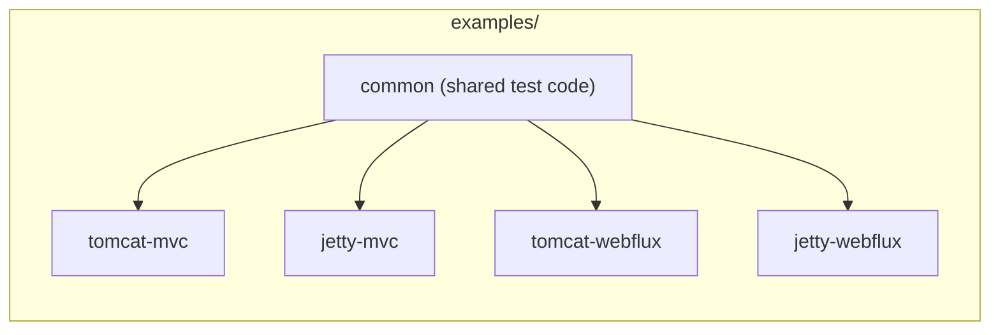
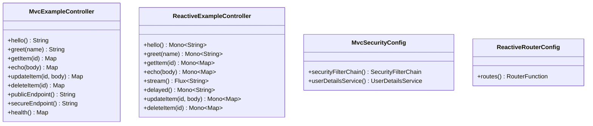
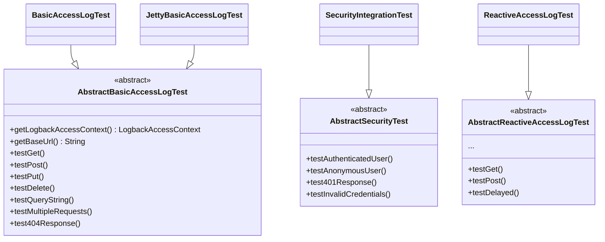
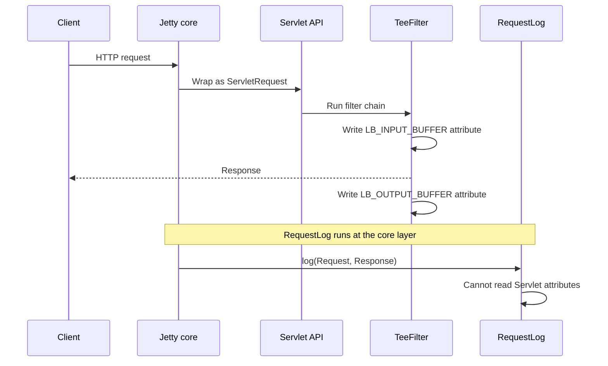

# Examples

Sample Spring Boot applications that exercise logback-access-spring-boot-starter end to end. Each module serves as an integration test that verifies library functionality against a real embedded server.

## Project Structure


```mermaid
flowchart TB
    subgraph ex["examples/"]
        direction TB
        common["common (shared test code)"]
        tm["tomcat-mvc"]
        jm["jetty-mvc"]
        tw["tomcat-webflux"]
        jw["jetty-webflux"]

        common --> tm
        common --> jm
        common --> tw
        common --> jw
    end
```

| Module | Server | Framework | Description |
|--------|--------|-----------|-------------|
| `common` | — | — | Shared controllers, security/router configuration, abstract test base classes, and test utilities. |
| `tomcat-mvc` | Tomcat | Spring MVC | Full feature coverage, including TeeFilter and Spring Security. |
| `jetty-mvc` | Jetty | Spring MVC | Full feature coverage except TeeFilter (see [Jetty Limitations](#jetty-limitations)). |
| `tomcat-webflux` | Tomcat | WebFlux | Reactive endpoint coverage. `%u` always renders as `-`. |
| `jetty-webflux` | Jetty | WebFlux | Reactive endpoint coverage. `%u` always renders as `-`. |

## Common Module

The `common` module hosts the shared production and test code so each example app stays minimal.

### Shared Application Code


```mermaid
classDiagram
    class MvcExampleController {
        +hello() String
        +greet(name) String
        +getItem(id) Map
        +echo(body) Map
        +updateItem(id, body) Map
        +deleteItem(id) Map
        +publicEndpoint() String
        +secureEndpoint() String
        +health() Map
    }

    class ReactiveExampleController {
        +hello() Mono~String~
        +greet(name) Mono~String~
        +getItem(id) Mono~Map~
        +echo(body) Mono~Map~
        +stream() Flux~String~
        +delayed() Mono~String~
        +updateItem(id, body) Mono~Map~
        +deleteItem(id) Mono~Map~
    }

    class MvcSecurityConfig {
        +securityFilterChain() SecurityFilterChain
        +userDetailsService() UserDetailsService
    }

    class ReactiveRouterConfig {
        +routes() RouterFunction
    }
```

| Package | Class | Description |
|---------|-------|-------------|
| `mvc` | `MvcExampleController` | REST controller used by the Spring MVC examples. |
| `mvc` | `MvcSecurityConfig` | Spring Security configuration used by the Spring MVC examples. |
| `webflux` | `ReactiveExampleController` | Reactive REST controller used by the WebFlux examples. |
| `webflux` | `ReactiveRouterConfig` | `RouterFunction` configuration used by the WebFlux examples. |

### Abstract Base Test Classes


```mermaid
classDiagram
    class AbstractBasicAccessLogTest {
        <<abstract>>
        +getLogbackAccessContext() LogbackAccessContext
        +getBaseUrl() String
        +testGet()
        +testPost()
        +testPut()
        +testDelete()
        +testQueryString()
        +testMultipleRequests()
        +test404Response()
    }

    class AbstractSecurityTest {
        <<abstract>>
        +testAuthenticatedUser()
        +testAnonymousUser()
        +test401Response()
        +testInvalidCredentials()
    }

    class AbstractReactiveAccessLogTest {
        <<abstract>>
        +testGet()
        +testPost()
        +testDelayed()
        ...
    }

    BasicAccessLogTest --|> AbstractBasicAccessLogTest
    JettyBasicAccessLogTest --|> AbstractBasicAccessLogTest
    SecurityIntegrationTest --|> AbstractSecurityTest
    ReactiveAccessLogTest --|> AbstractReactiveAccessLogTest
```

| Package | Class | Coverage |
|---------|-------|----------|
| (root) | `AbstractBasicAccessLogTest` | HTTP method coverage (GET / POST / PUT / DELETE, query string, repeated requests, 404). |
| (root) | `AbstractSecurityTest` | Authenticated vs anonymous principal handling, 401 response, invalid credentials. |
| `test.mvc` | `AbstractTeeFilterTest` | Request/response body capture via TeeFilter. |
| `test.mvc` | `AbstractLocalPortStrategyTest` | `local-port-strategy` resolution on the Servlet stack. |
| `test.common` | `AbstractJsonLoggingTest` | JSON output via `LogstashAccessEncoder`. |
| `test.common` | `AbstractSpringPropertyScopeTest` | `<springProperty>` `LOCAL` vs `context` scope. |
| `test.common` | `AbstractDisabledAccessLogTest` | `logback.access.enabled=false` disables auto-configuration. |
| `test.webflux` | `AbstractReactiveAccessLogTest` | Reactive endpoint coverage. |
| `test.webflux` | `AbstractReactiveLocalPortStrategyTest` | `local-port-strategy` resolution on the reactive stack. |
| `test.webflux` | `AbstractRouterFunctionTest` | Functional routing coverage. |

### Test Utilities

| Class | Description |
|-------|-------------|
| `HttpClientTestUtils` | HTTP client wrapper around `java.net.http.HttpClient` with Basic auth support. |
| `AccessEventTestUtils` | Retrieves access events from a `ListAppender` with polling-based waits. |

## Requirements

| Component | Version |
|-----------|---------|
| Java | 21 or later |
| Gradle | Provided by the Gradle Wrapper (no separate installation needed) |

## Running Tests

### All Modules

```bash
./gradlew :examples:tomcat-mvc:test :examples:jetty-mvc:test \
          :examples:tomcat-webflux:test :examples:jetty-webflux:test
```

### Specific Module

```bash
./gradlew :examples:tomcat-mvc:test
./gradlew :examples:jetty-mvc:test
```

### Specific Test Class

```bash
./gradlew :examples:tomcat-mvc:test --tests "*BasicAccessLogTest*"
./gradlew :examples:tomcat-mvc:test --tests "*SecurityIntegrationTest*"
```

## Feature Coverage

| Feature | Tomcat MVC | Jetty MVC | Tomcat WebFlux | Jetty WebFlux |
|---------|:----------:|:---------:|:--------------:|:-------------:|
| Basic HTTP methods | ✓ | ✓ | ✓ | ✓ |
| Query string | ✓ | ✓ | ✓ | ✓ |
| Path variables | ✓ | ✓ | ✓ | ✓ |
| 404 response | ✓ | ✓ | ✓ | ✓ |
| Spring Security `%u` | ✓ | ✓ | — | — |
| TeeFilter body capture | ✓ | ✗ | — | — |
| `local-port-strategy` | ✓ | ✓ | ✓ | ✓ |
| URL filtering | ✓ | ✓ | ✓ | ✓ |
| JSON logging | ✓ | ✓ | ✓ | ✓ |
| Spring profiles | ✓ | ✓ | ✓ | ✓ |
| `<springProperty>` | ✓ | ✓ | ✓ | ✓ |
| `logback.access.enabled=false` | ✓ | ✓ | ✓ | ✓ |
| `RouterFunction` | — | — | ✓ | ✓ |
| Delayed reactive response | — | — | ✓ | ✓ |

**Legend**: ✓ = supported / ✗ = not supported / — = not applicable

## Jetty Limitations

### TeeFilter

TeeFilter is not supported on Jetty 12. The Jetty 12 `RequestLog` API operates at the core server level, below the Servlet container; TeeFilter writes its captured buffers (`LB_INPUT_BUFFER` / `LB_OUTPUT_BUFFER`) as Servlet request attributes, which the `RequestLog` cannot read.


```mermaid
sequenceDiagram
    participant Client
    participant Core as Jetty core
    participant Servlet as Servlet API
    participant Tee as TeeFilter
    participant RL as RequestLog

    Client->>Core: HTTP request
    Core->>Servlet: Wrap as ServletRequest
    Servlet->>Tee: Run filter chain
    Tee->>Tee: Write LB_INPUT_BUFFER attribute
    Tee-->>Client: Response
    Tee->>Tee: Write LB_OUTPUT_BUFFER attribute

    Note over Core,RL: RequestLog runs at the core layer
    Core->>RL: log(Request, Response)
    RL->>RL: Cannot read Servlet attributes
```

The `JettyTeeFilterTest` class in `jetty-mvc` is annotated `@Disabled` to make this limitation explicit.

## Test Classes by Module

Each example app composes the abstract base classes from `common` to cover the feature matrix on its server. Test counts are not listed here because they evolve frequently; run `./gradlew :examples:<module>:test --info` to see the executed tests for a given module.

### Tomcat MVC

| Test Class | Coverage |
|------------|----------|
| `BasicAccessLogTest` | Access log emission for the standard HTTP methods. |
| `SecurityIntegrationTest` | Spring Security `%u` capture. |
| `TeeFilterTest` | Request/response body capture via TeeFilter. |
| `LocalPortStrategyTest` | `local-port-strategy` resolution. |
| `UrlFilteringTest` | URL pattern filtering. |
| `JsonLoggingTest` | JSON output via `LogstashAccessEncoder`. |
| `SpringProfileTest` | Profile-specific appenders. |
| `SpringPropertyScopeTest` | `<springProperty>` scopes. |
| `DisabledAccessLogTest` | `logback.access.enabled=false` disables auto-configuration. |

### Jetty MVC

| Test Class | Coverage |
|------------|----------|
| `JettyBasicAccessLogTest` | Access log emission for the standard HTTP methods. |
| `JettySecurityTest` | Spring Security `%u` capture. |
| `JettyTeeFilterTest` | `@Disabled` — TeeFilter is not supported on Jetty 12 (see [Jetty Limitations](#jetty-limitations)). |
| `JettyLocalPortStrategyTest` | `local-port-strategy` resolution. |
| `JettyUrlFilteringTest` | URL pattern filtering. |
| `JettyJsonLoggingTest` | JSON output via `LogstashAccessEncoder`. |
| `JettySpringProfileTest` | Profile-specific appenders. |
| `JettySpringPropertyScopeTest` | `<springProperty>` scopes. |
| `JettyDisabledAccessLogTest` | `logback.access.enabled=false` disables auto-configuration. |

### Tomcat WebFlux

| Test Class | Coverage |
|------------|----------|
| `ReactiveAccessLogTest` | Reactive endpoint access log emission. |
| `RouterFunctionTest` | `RouterFunction` route coverage. |
| `UrlFilteringTest` | URL pattern filtering. |
| `LocalPortStrategyTest` | `local-port-strategy` resolution. |
| `JsonLoggingTest` | JSON output via `LogstashAccessEncoder`. |
| `SpringProfileTest` | Profile-specific appenders. |
| `SpringPropertyScopeTest` | `<springProperty>` scopes. |
| `DisabledAccessLogTest` | `logback.access.enabled=false` disables auto-configuration. |

### Jetty WebFlux

| Test Class | Coverage |
|------------|----------|
| `ReactiveAccessLogTest` | Reactive endpoint access log emission. |
| `RouterFunctionTest` | `RouterFunction` route coverage. |
| `UrlFilteringTest` | URL pattern filtering. |
| `LocalPortStrategyTest` | `local-port-strategy` resolution. |
| `JsonLoggingTest` | JSON output via `LogstashAccessEncoder`. |
| `SpringProfileTest` | Profile-specific appenders. |
| `SpringPropertyScopeTest` | `<springProperty>` scopes. |
| `DisabledAccessLogTest` | `logback.access.enabled=false` disables auto-configuration. |

## Log Output Examples

### Configuration

Common Log Format (CLF) pattern in `logback-access.xml`:

```xml
<configuration>
    <appender name="console" class="ch.qos.logback.core.ConsoleAppender">
        <encoder>
            <pattern>%h %l %u [%t] "%r" %s %b</pattern>
        </encoder>
    </appender>
    <appender-ref ref="console"/>
</configuration>
```

### Pattern Elements

| Conversion | Description | Example |
|------------|-------------|---------|
| `%h` | Remote host | `127.0.0.1` |
| `%l` | Remote log name | `-` |
| `%u` | Authenticated user | `admin` |
| `%t` | Timestamp | `06/Feb/2026:15:30:45 +0900` |
| `%r` | Request line | `GET /api/hello HTTP/1.1` |
| `%s` | Status code | `200` |
| `%b` | Response size | `13` |

### Output Examples

```
# Basic GET
127.0.0.1 - - [06/Feb/2026:15:30:45 +0900] "GET /api/hello HTTP/1.1" 200 13

# GET with Query String
127.0.0.1 - - [06/Feb/2026:15:30:46 +0900] "GET /api/greet?name=Alice HTTP/1.1" 200 14

# POST (JSON Body)
127.0.0.1 - - [06/Feb/2026:15:30:47 +0900] "POST /api/echo HTTP/1.1" 200 27

# Authenticated User
127.0.0.1 - admin [06/Feb/2026:15:30:50 +0900] "GET /api/secure HTTP/1.1" 200 14

# 404 Not Found
127.0.0.1 - - [06/Feb/2026:15:30:51 +0900] "GET /api/nonexistent HTTP/1.1" 404 -
```

### Extended Pattern

For detailed logging that includes referer, user agent, and processing time:

```xml
<pattern>%h %l %u [%t] "%r" %s %b "%{Referer}i" "%{User-Agent}i" %D</pattern>
```

Output:

```
127.0.0.1 - - [06/Feb/2026:15:30:45 +0900] "GET /api/hello HTTP/1.1" 200 13 "-" "Java-http-client/21" 45
```

## Configuration Files

### Application Configuration

| File | Purpose |
|------|---------|
| `application.yml` | Base configuration. |
| `application-teefilter.yml` | Enables TeeFilter for the relevant tests. |
| `application-dev.yml` | Settings activated by the `dev` profile. |
| `application-prod.yml` | Settings activated by the `prod` profile. |

### Logback Access Configuration

| File | Purpose |
|------|---------|
| `logback-access.xml` | Production-style configuration with the console appender. |
| `logback-access-test.xml` | Test configuration using a `ListAppender` for assertions. |
| `logback-access-spring-profile.xml` | Profile-specific configuration with `<springProfile>`. |
| `logback-access-spring-property.xml` | Verifies `<springProperty>` resolution. |
| `logback-access-json.xml` | JSON output via `LogstashAccessEncoder`. |

## Test Utilities

### HttpClientTestUtils

HTTP request utility wrapping `java.net.http.HttpClient`:

```java
// GET request
HttpClientTestUtils.get(url);
HttpClientTestUtils.getWithQuery(url, "param=value");

// POST request (JSON)
HttpClientTestUtils.post(url, "{\"key\":\"value\"}");

// Request with Basic authentication
HttpClientTestUtils.getWithBasicAuth(url, "user", "password");
```

### AccessEventTestUtils

Access event retrieval with polling:

```java
// Get ListAppender
var appender = AccessEventTestUtils.getListAppender(context, "list");

// Wait for event (default: 1 event, 5-second timeout)
var events = AccessEventTestUtils.awaitEvents(appender);

// Wait for multiple events
var events = AccessEventTestUtils.awaitEvents(appender, 3);

// Custom timeout
var events = AccessEventTestUtils.awaitEvents(appender, 1, 10000L);
```

## Configuration Properties

### Disabling access logging

Setting `logback.access.enabled=false` skips the auto-configuration entirely; no `logbackAccessContext` bean is registered:

```java
@SpringBootTest(properties = "logback.access.enabled=false")
class DisabledAccessLogTest {
    @Test
    void logbackAccessContextBeanNotPresent(@Autowired ApplicationContext ctx) {
        assertThat(ctx.containsBean("logbackAccessContext")).isFalse();
    }
}
```

### `local-port-strategy`

| Value | Description |
|-------|-------------|
| `server` (default) | The port the client addressed. With `RemoteIpValve` and `request-attributes-enabled`, this honors `X-Forwarded-Port`. |
| `local` | The port of the local interface that accepted the connection. |

```yaml
logback:
  access:
    local-port-strategy: local
```

### `<springProperty>` scope

The default `LOCAL` scope only resolves values during XML parsing for variable substitution. To read the value programmatically via `context.getProperty()`, set `scope="context"`:

```xml
<springProperty name="appName" source="spring.application.name"
                defaultValue="default" scope="context"/>
```

The value is then accessible via `context.getProperty("appName")`.

## Troubleshooting

### Access events are not emitted

1. Confirm `logback.access.enabled=true` (the default).
2. Confirm `logback-access-test.xml` is on the classpath in test scope.
3. Confirm the `ListAppender` is referenced by `<appender-ref>` in the configuration.

### TeeFilter does not capture the body

1. Confirm `logback.access.tee-filter.enabled=true`.
2. Confirm the `Content-Type` is in the allowed list (binary content is suppressed).
3. On Jetty 12, TeeFilter is not supported — switch to Tomcat or remove the assertion.

### Spring Security username is not logged

1. Confirm Spring Security is on the classpath.
2. Confirm the request is authenticated (and not represented by an anonymous token).
3. Confirm the application is Servlet-based — reactive applications always render `%u` as `-`.
